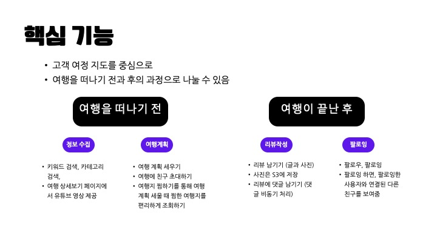
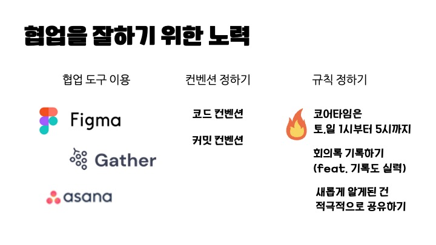

<h1 align="center">TrendGaza</h1>

<h4 align="center">
  🔗 여행자들을 연결해주는 소셜 플랫폼, 트렌드가자 🥾
</h4>

### Member

| 프론트엔드, 백엔드  | 프론트엔드, 백엔드 |
| ------------- | ------------- |
| [민정](https://github.com/likelasttime)  | [줄리](https://github.com/JulieOnIsland)  |

 

## 📌 About TrendGaza
여행은 바쁘고 지친 일상 생활에서 벗어나 잠시 쉼표를 찍을 수 있게 해주고, 중요한 게 무엇인지를 깨닫게 해줄 때가 있습니다. 또한 여행으로 사랑하는 가족, 친구들과 추억을 쌓을 수 있고, 영감을 얻을 수 있습니다. 

​여행 중에 혹은 여행이 끝난 다음 여러분은 무엇을 하셨나요? 인상깊었던 여행지나 맛집 사진, 동영상을 올리거나 다른 사람들과 공유하지 않으셨나요? 사진이나 영상을 올렸다면, 혹은 내 경험을 공유했다면, 왜 그 행동을 하셨나요? 

우리는 모두 자신의 경험이나 이야기를 다른 사람들과 나누고자 하는 욕망이 있습니다. 그리고 본질적으로는 다른 사람들과 **연결**되고자 하는 욕망이 있습니다. 

바로 여기, 여행자들을 연결해주는 소셜 플랫폼, `트렌드 가자`가 있습니다.  
그렇다면 트렌드 가자의 기능들을 살펴볼까요?

### 👫 Service

### ⚒️ Skills

### ERD

### 📝 Ground Rules
